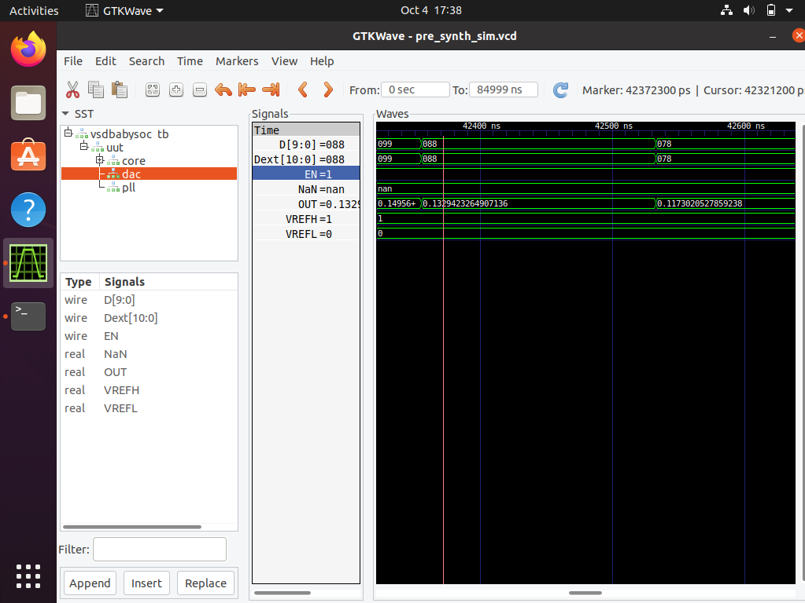

# VSDBabySoC: RTL Synthesis and Simulation Project

## 🎯 Objective
The goal of this project is to **build a solid understanding of SoC fundamentals** and practice functional modeling of the **BabySoC** using simulation tools.  

The **VSDBabySoC** is a simple System-on-Chip (SoC) design that incorporates:  

- **RISC-V processor (`rvmyth`)**  
- **PLL (Phase-Locked Loop) module (`pll`)**  
- **DAC (Digital-to-Analog Converter) module (`dac`)**  

This project demonstrates **integration of these IP cores** and aims to **simulate and verify the design behavior** using **pre-synthesis** and **post-synthesis simulations**.

---

## 🛠️ Tools Used

1. **Yosys – RTL Synthesis Tool**  
   - Converts RTL code into gate-level representations.

2. **Icarus Verilog & GTKWave**  
   - **Icarus Verilog:** For compilation and simulation.  
   - **GTKWave:** For viewing waveform files.

---

## 📂 Project Structure

```txt
VSDBabySoC/
├── src/
│   ├── include/           # Header files (*.vh) with macros & parameters
│   ├── module/            # All design modules (Verilog + TL-Verilog)
│   │   ├── vsdbabysoc.v   # Top-level SoC integration
│   │   ├── rvmyth.v       # RISC-V CPU core
│   │   ├── avsdpll.v      # Phase-Locked Loop module
│   │   ├── avsddac.v      # Digital-to-Analog Converter
│   │   └── testbench.v    # Simulation testbench
├── output/                # Simulation results & compiled files
│   ├── pre_synth_sim/     # Pre-synthesis simulation outputs
│   └── post_synth_sim/    # Post-synthesis simulation outputs
└── images/                # Documentation & waveform screenshots
```
---
🔧 TL-Verilog to Verilog Conversion

The RVMYTH CPU core is written in TL-Verilog and needs conversion to Verilog for simulation:
```bash
# Install required tools
sudo apt update
sudo apt install python3-venv python3-pip

# Create and activate virtual environment
python3 -m venv sp_env
source sp_env/bin/activate

# Install SandPiper-SaaS for TLV conversion
pip install pyyaml click sandpiper-saas

# Convert all TL-Verilog files to Verilog
sandpiper-saas -i ./src/module/*.tlv -o rvmyth.v --bestsv --noline -p verilog --outdir ./src/module/
```
✅ After conversion, rvmyth.v will be available alongside other Verilog modules.

🧪 Simulation Flow
🔹 Pre-Synthesis Simulation
```bash
# Create output directory
mkdir -p output/pre_synth_sim

# Compile design with pre-synthesis flag
iverilog -o output/pre_synth_sim/pre_synth_sim.out \
  -DPRE_SYNTH_SIM \
  -I src/include -I src/module \
  src/module/testbench.v

# Run simulation
cd output/pre_synth_sim
./pre_synth_sim.out
```
📊 View Waveforms in GTKWave
```bash
gtkwave pre_synth_sim.vcd
```
---
### 📈 Simulation Results & Waveforms

#### 🔍 Key Signals to Observe

| Signal                  | Description                                      |
|-------------------------|--------------------------------------------------|
| `CLK`                   | Clock signal generated by PLL                    |
| `reset`                 | System reset signal                              |
| `OUT`                   | Analog output from DAC (digital representation in simulation) |
| `RV_TO_DAC[9:0]`        | 10-bit data bus from RISC-V core to DAC input   |
| `VCO_IN, ENb_CP, ENb_VCO` | PLL control signals                            |
| `VREFH`                 | DAC reference voltage input                      |

🧩 1️⃣ Reset Operation

### 🧩 Key Observations

- `OUT = 0.132` → Analog voltage output from DAC  
- `D[9:0] = 088` → Digital input to DAC from RISC-V core  
- `EN = 1` → DAC is enabled  
- `VREFH = 1`, `VREFL = 0` → DAC reference voltages  

**Interpretation:**  
- The RISC-V core is successfully sending digital data to the DAC.  
- DAC converts digital input into analog voltage correctly.  
- Demonstrates proper integration of CPU, PLL, and DAC in pre-synthesis.
---
### ⏱️ 2️⃣ Clocking Behavior

**CLK = 0**

- System is in low clock phase; components are momentarily static.  
- `RV_TO_DAC = 387` → Stable digital value.  
- DAC outputs `0.88V` analog voltage.  
- PLL and CPU operating normally.  

**CLK = 1**

- Clock rising edge triggers data sampling and DAC update.  
- Digital → Analog conversion works in sync with clock.  
---

### 🔄 OUT Voltage Variation


| OUT | CLK | Digital Input | DAC Output | Reset | Timing     |
|-----|-----|---------------|------------|-------|-----------|
| 0   | 1   | 0BE (190)     | 0.18V      | 0     | 18704 ns  |
| 1   | 0   | 387 (903)     | 0.88V      | 0     | 22891 ns  |

### 🔍 Observations

- System works during both high and low clock phases.  
- DAC maintains linear digital-to-analog conversion.  
- Timing shows continuous operation over microseconds.  
- `Reset = 0` confirms stable operation.
---
### 🔁 3️⃣ Dataflow Between Modules 


- Digital input from CPU: `D[9:0] = 12C`  
- Passed to DAC: `Dext[10:0] = 12C`  
- DAC converts to analog output: `OUT ≈ 0.29V`
Conclusion:
Digital data flows correctly from CPU → DAC → Analog output, forming a smooth waveform. This confirms correct module integration and data transfer.
